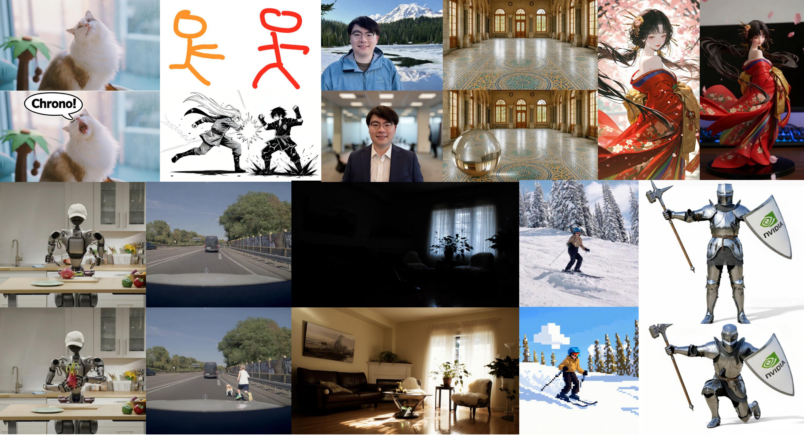
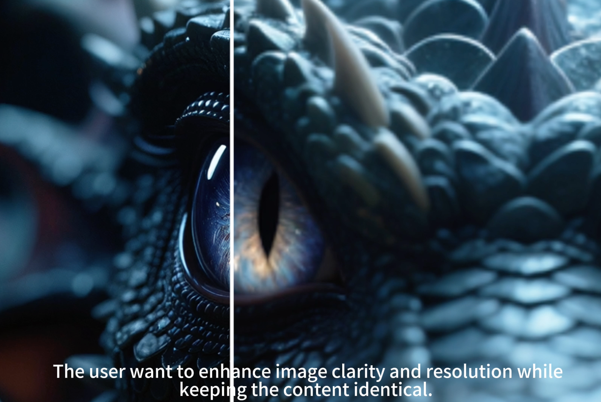

<div align="center">


<div align="center">
  <!-- Replace the src below with a repo-local path if available -->
  
</div>
<strong>ChronoEdit: Towards Temporal Reasoning for Image Editing and World Simulation</strong>

[Jay Zhangjie Wu*](https://zhangjiewu.github.io/) &nbsp;&nbsp; [Xuanchi Ren*](https://xuanchiren.com/) &nbsp;&nbsp; [Tianchang Shen](https://www.cs.toronto.edu/~shenti11/) &nbsp;&nbsp; [Tianshi Cao](https://www.cs.toronto.edu/~hekai/) &nbsp;&nbsp; [Kai He](https://www.cs.toronto.edu/~hekai/)
<br>
[Yifan Lu](https://yifanlu0227.github.io/) &nbsp;&nbsp; [Ruiyuan Gao](https://gaoruiyuan.com/) &nbsp;&nbsp; [Enze Xie](https://xieenze.github.io/) &nbsp;&nbsp; [Shiyi Lan](https://voidrank.github.io/) &nbsp;&nbsp; [Jose M. Alvarez](https://alvarezlopezjosem.github.io/) 
<br>
[Jun Gao](https://www.cs.toronto.edu/~jungao/) &nbsp;&nbsp; [Sanja Fidler](https://www.cs.utoronto.ca/~fidler/) &nbsp;&nbsp;
[Zian Wang](https://www.cs.toronto.edu/~zianwang/) &nbsp;&nbsp; [Huan Ling*†](https://www.cs.toronto.edu/~linghuan/)

<sup>* equal contribution &nbsp;&nbsp; † corresponding author</sup>

<p align="center">
    📖 <a href="https://research.nvidia.com/labs/toronto-ai/chronoedit/"><b>Project Page</b></a> &nbsp&nbsp  | &nbsp&nbsp🤗 <a href="https://huggingface.co/nvidia/ChronoEdit-14B-Diffusers">ChronoEdit-14B</a>&nbsp&nbsp | &nbsp&nbsp 📑 <a href="https://arxiv.org/abs/2510.04290">Arxiv
<br>

> **TL;DR:** ChronoEdit reframes image editing as a video generation task, using input and edited images as start/end frames to leverage pretrained video models with temporal consistency. A temporal reasoning stage introduces reasoning tokens to ensure physically plausible edits and visualize the editing trajectory.

</div>

<div align="center">
  <!-- Replace the src below with a repo-local path if available -->
  
</div>

# 🫨 News
- ```2025/11/10```: 👋 ChronoEdit-14B-Diffusers-Upscaler-Lora is released on 🤗  <a href="https://huggingface.co/nvidia/ChronoEdit-14B-Diffusers-Upscaler-Lora">HuggingFace</a>  
- ```2025/11/10```: 👋 ChronoEdit is officially merged into diffusers <a href="https://huggingface.co/docs/diffusers/main/api/pipelines/chronoedit">Pipeline</a>  
- ```2025/10/29```: 👋 ChronoEdit-14B is released on 🤗 <a href="https://huggingface.co/nvidia/ChronoEdit-14B-Diffusers">HuggingFace</a> !
- ```2025/10/04```: 👋 ChronoEdit <a href="https://arxiv.org/abs/2510.04290">paper</a> is released

# 🤗 Open Source Plan
- ChronoEdit 
  - [x] Inference with Diffuser
  - [x] LoRA Training with DiffSynth-Studio
  - [x] ChronoEdit-14B Checkpoints
  - [x] ChronoEdit-14B 8-Steps Distilled LoRA Checkpoints
  - [ ] ChronoEdit-2B Checkpoints
  - [ ] ChronoEdit-2B 4-Steps Distilled LoRA Checkpoints
  - [ ] Full Model Training Infrastructure  


# 📑  Quick Start

### Installation
Clone the repo:
```sh
git clone https://github.com/nv-tlabs/ChronoEdit
cd ChronoEdit
```

This repo runs only on Linux systems and requires python 3.10:
```bash
conda env create -f environment.yml -n chronoedit_mini
conda activate chronoedit_mini
pip install torch==2.7.1 torchvision==0.22.1
pip install -r requirements_minimal.txt
```
Optional: Install flash attention with cudatoolkit if you want faster interence. Model can run without installation.  
```bash
# You may need to set a limit to the number of threads used during compilation to prevent OOM Errors.
export MAX_JOBS=16
pip install flash-attn==2.6.3
```

Download diffusers checkpoint from HuggingFace:
```bash
hf download nvidia/ChronoEdit-14B-Diffusers --local-dir checkpoints/ChronoEdit-14B-Diffusers
```

### Diffusers Inference 🤗

> [!NOTE]
> ```2025/11/10 Update```: ChronoEdit is officially merged into diffuser, checkout official pipeline at <a href="https://huggingface.co/docs/diffusers/main/api/pipelines/chronoedit">LINK</a>  
 

(1) Single GPU Inference

Run inference with default hyperparameters. 
```bash
PYTHONPATH=$(pwd) python scripts/run_inference_diffusers.py \
--input assets/images/input_2.png --offload_model --use-prompt-enhancer \
--prompt "Add a sunglasses to the cat's face"  \
--output output.mp4 \
--model-path ./checkpoints/ChronoEdit-14B-Diffusers
```
Append tag `--enable-temporal-reasoning` to enable temporal reasoning for better consistency. 

> [!NOTE]
> The inference requires ~ 34G GPU memory with --offload_model flag turned on.
> 
> In temporal reasoning mode, GPU memory requirement is increased to ~ 38G. 
 

(2) With Prompt enhancer

Append tag ` --use-prompt-enhancer` to turn on auto prompt enhancer.

You can adjust the `--prompt_enhancer_model` flag to select a different model. As default, we recommend using [Qwen/Qwen3-VL-30B-A3B-Instruct](https://huggingface.co/Qwen/Qwen3-VL-30B-A3B-Instruct), which delivers the best results but requires up to 60 GB of peak memory. Smaller vision-language models are supported as well, though they may produce lower-quality outputs.

> [!NOTE]
> We strongly suggest the users to read [Prompt Guidance](docs/PROMPT_GUIDANCE.md) and use our provided prompt enhancer for best results. 

> [!NOTE]
> If you prefer not to host the prompt enhancer locally, you can use the provided [System prompt](https://github.com/nv-tlabs/ChronoEdit/blob/main/scripts/prompt_enhancer.py#L199) with any modern online LLM chat agent.


(3) With 8 Steps distillation LoRA

With distillation LoRA, we recommend to set hyperparameter as `--flow-shift 2.0`, `--guidance-scale 1.0` and `--num-inference-steps 8`
```bash
# Advanced usage with lora settings
PYTHONPATH=$(pwd) python scripts/run_inference_diffusers.py --use-prompt-enhancer --offload_model \
--input assets/images/input_2.png \
--prompt "Add a sunglasses to the cat's face"  \
--output output_lora.mp4 \
--num-inference-steps 8 \
--guidance-scale 1.0 \
--flow-shift 2.0 \
--lora-scale 1.0 \
--seed 42 \
--lora-path ./checkpoints/ChronoEdit-14B-Diffusers/lora/chronoedit_distill_lora.safetensors \
--model-path ./checkpoints/ChronoEdit-14B-Diffusers
```

(4) With other LoRAs

#### ChronoEdit-14B-Diffusers-Upscaler-Lora  🤗
```bash
hf download nvidia/ChronoEdit-14B-Diffusers-Upscaler-Lora --local-dir checkpoints/ChronoEdit-14B-Diffusers-Upscaler-Lora
```
<div align="center">
  <!-- Replace the src below with a repo-local path if available -->
  
</div>

The model is tested until 2k resolution.
```bash
PYTHONPATH=$(pwd) python scripts/run_inference_diffusers.py \
    --input assets/images/lr.png --width 1584 --height 1056 \
    --prompt "The user want to enhance image clarity and resolution while keeping the content identical. super-resolution, high detail, 4K clarity, same composition, natural texture."  \
    --output output_sr_lora.mp4 \
    --lora-scale 1.0 \
    --seed 42 \
    --lora-path ./checkpoints/ChronoEdit-14B-Diffusers-Upscaler-Lora/upsample_lora_diffusers.safetensors \
    --model-path ./checkpoints/ChronoEdit-14B-Diffusers
```

# 📑 LoRA Finetune with Diffsynth-Studio

Install Diffsynth-Studio:
```bash
pip install git+https://github.com/modelscope/DiffSynth-Studio.git
```

Training LoRA with Diffsynth. See [Dataset Doc](docs/CREAT_DATASET.md) for dataset prepartion guidance: 

```bash
PYTHONPATH=$(pwd) accelerate launch scripts/train_diffsynth.py \
    --dataset_base_path data/example_dataset \
    --dataset_metadata_path data/example_dataset/metadata.csv \
    --height 1024 \
    --width 1024 \
    --num_frames 5 \
    --dataset_repeat 1 \
    --model_paths '[["checkpoints/ChronoEdit-14B-Diffusers/transformer/diffusion_pytorch_model-00001-of-00014.safetensors","checkpoints/ChronoEdit-14B-Diffusers/transformer/diffusion_pytorch_model-00002-of-00014.safetensors","checkpoints/ChronoEdit-14B-Diffusers/transformer/diffusion_pytorch_model-00003-of-00014.safetensors","checkpoints/ChronoEdit-14B-Diffusers/transformer/diffusion_pytorch_model-00004-of-00014.safetensors","checkpoints/ChronoEdit-14B-Diffusers/transformer/diffusion_pytorch_model-00005-of-00014.safetensors","checkpoints/ChronoEdit-14B-Diffusers/transformer/diffusion_pytorch_model-00006-of-00014.safetensors","checkpoints/ChronoEdit-14B-Diffusers/transformer/diffusion_pytorch_model-00007-of-00014.safetensors","checkpoints/ChronoEdit-14B-Diffusers/transformer/diffusion_pytorch_model-00008-of-00014.safetensors","checkpoints/ChronoEdit-14B-Diffusers/transformer/diffusion_pytorch_model-00009-of-00014.safetensors","checkpoints/ChronoEdit-14B-Diffusers/transformer/diffusion_pytorch_model-00010-of-00014.safetensors","checkpoints/ChronoEdit-14B-Diffusers/transformer/diffusion_pytorch_model-00011-of-00014.safetensors","checkpoints/ChronoEdit-14B-Diffusers/transformer/diffusion_pytorch_model-00012-of-00014.safetensors","checkpoints/ChronoEdit-14B-Diffusers/transformer/diffusion_pytorch_model-00013-of-00014.safetensors","checkpoints/ChronoEdit-14B-Diffusers/transformer/diffusion_pytorch_model-00014-of-00014.safetensors"]]' \
    --model_id_with_origin_paths "Wan-AI/Wan2.1-I2V-14B-720P:models_t5_umt5-xxl-enc-bf16.pth,Wan-AI/Wan2.1-I2V-14B-720P:Wan2.1_VAE.pth,Wan-AI/Wan2.1-I2V-14B-720P:models_clip_open-clip-xlm-roberta-large-vit-huge-14.pth" \
    --learning_rate 1e-4 \
    --num_epochs 5 \
    --remove_prefix_in_ckpt "pipe.dit." \
    --output_path "./models/train/ChronoEdit-14B_lora" \
    --lora_base_model "dit" \
    --lora_target_modules "q,k,v,o,ffn.0,ffn.2" \
    --lora_rank 32 \
    --extra_inputs "input_image" \
    --use_gradient_checkpointing_offload
```


Inference with Diffsynth:
```bash
PYTHONPATH=$(pwd) python scripts/run_inference_diffsynth.py
```

Inference with Diffsynth (Multi-GPUs):
```bash
PYTHONPATH=$(pwd) torchrun --standalone --nproc_per_node=8 scripts/run_inference_diffsynth.py
```


# 📑 Full Model Training Framework
We release **ChronoEdit’s** full training infrastructure and codebase, enabling **distributed inference** and **large-scale fine-tuning** of pretrained video diffusion models. See [Training Doc](docs/FULL_MODEL_TRAINING.md) for details.


# 📑  Create Your Own Training Dataset

We provide an automated editing labeling script to generate high-quality editing instructions from pairs of images (before and after editing). The script uses state-of-the-art vision-language models to analyze image pairs and generate precise editing prompts with Chain-of-Thought (CoT) reasoning.  See dataset guidance [doc](docs/CREAT_DATASET.md) for details.

# Acknowledgments
 
The authors would like to thank Product Managers Aditya Mahajan and Matt Cragun for their valuable guidance and support. We further acknowledge the Cosmos Team at NVIDIA, especially Qinsheng Zhang and Hanzi Mao, for their consultation on Cosmos-Pred2.5-2B. We also thank Yuyang Zhao, Junsong Chen, and Jincheng Yu for their insightful discussions. Finally, we are grateful to Ben Cashman, Yuting Yang, and Amanda Moran for their infrastructure support.

Also shout-out to Wiedemer et al., Video Models are Zero-Shot Learners and Reasoners (2025) — while the two projects were developed concurrently, several of our examples were inspired by this excellent work.
 

# Citation


```bibtex
@article{wu2025chronoedit,
    title={ChronoEdit: Towards Temporal Reasoning for Image Editing and World Simulation},
    author={Wu, Jay Zhangjie and Ren, Xuanchi and Shen, Tianchang and Cao, Tianshi and He, Kai and Lu, Yifan and Gao, Ruiyuan and Xie, Enze and Lan, Shiyi and Alvarez, Jose M. and Gao, Jun and Fidler, Sanja and Wang, Zian and Ling, Huan},
    journal={arXiv preprint arXiv:2510.04290},
    year={2025}
}
```
