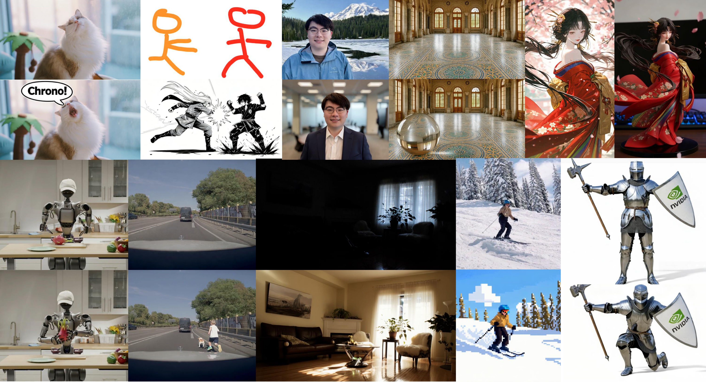

<div align="center">

# ChronoEdit

<h3>Towards Temporal Reasoning for Image Editing and World Simulation</h3>

[Jay Zhangjie Wu*](https://zhangjiewu.github.io/) &nbsp;&nbsp; [Xuanchi Ren*](https://xuanchiren.com/) &nbsp;&nbsp; [Tianchang Shen](https://www.cs.toronto.edu/~shenti11/) &nbsp;&nbsp; [Tianshi Cao](https://www.cs.toronto.edu/~hekai/) &nbsp;&nbsp; [Kai He](https://www.cs.toronto.edu/~hekai/)
<br>
[Yifan Lu](https://yifanlu0227.github.io/) &nbsp;&nbsp; [Ruiyuan Gao](https://gaoruiyuan.com/) &nbsp;&nbsp; [Enze Xie](https://xieenze.github.io/) &nbsp;&nbsp; [Shiyi Lan](https://voidrank.github.io/) &nbsp;&nbsp; [Jose M. Alvarez](https://alvarezlopezjosem.github.io/) 
<br>
[Jun Gao](https://www.cs.toronto.edu/~jungao/) &nbsp;&nbsp; [Sanja Fidler](https://www.cs.utoronto.ca/~fidler/) &nbsp;&nbsp;
[Zian Wang](https://www.cs.toronto.edu/~zianwang/) &nbsp;&nbsp; [Huan Ling*†](https://www.cs.toronto.edu/~linghuan/)
<sup>* equal contribution &nbsp;&nbsp; † corresponding author</sup>

<p align="center">
    📖 <a href="https://research.nvidia.com/labs/toronto-ai/chronoedit/">Project Page</a> &nbsp&nbsp | &nbsp&nbsp 📑 <a href="https://arxiv.org/abs/2510.04290">Technical Report</a> &nbsp&nbsp  | &nbsp&nbsp🤗 <a href="https://huggingface.co/nvidia/ChronoEdit-14B">ChronoEdit-14B</a>&nbsp&nbsp | &nbsp&nbsp🤗 <a href="https://huggingface.co/nvidia/ChronoEdit-2B">ChronoEdit-2B</a>&nbsp&nbsp
<br>

> **TL;DR:** ChronoEdit reframes image editing as a video generation task, using input and edited images as start/end frames to leverage pretrained video models with temporal consistency. A temporal reasoning stage introduces reasoning tokens to ensure physically plausible edits and visualize the editing trajectory.

</div>

<div align="center">
  <!-- Replace the src below with a repo-local path if available -->
  
</div>

## Code and Models Coming Soon

## Citation

```bibtex
@article{wu2025chronoedit,
    title={ChronoEdit: Towards Temporal Reasoning for Image Editing and World Simulation},
    author={Wu, Jay Zhangjie and Ren, Xuanchi and Shen, Tianchang and Cao, Tianshi and He, Kai and Lu, Yifan and Gao, Ruiyuan and Xie, Enze and Lan, Shiyi and Alvarez, Jose M. and Gao, Jun and Fidler, Sanja and Wang, Zian and Ling, Huan},
    journal={arXiv preprint arXiv:2510.04290},
    year={2025}
}
```